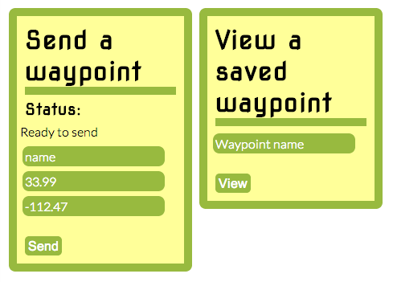

radiocollar
===========
A location sharing app I wrote 4.2 million years ago using Sinatra and MongoDB. [Newer (but still ancient) version is up on Heroku](http://radiocollar.herokuapp.com/)

Running the code
================
1. `ruby app.rb`

Works fine on Ruby 2.1.1

Sending your location
=====================
1. Type a name for your waypoint
2. submit

Viewing someone elses location
==============================
1. Enter the waypoint name into the form
2. submit

_OR_

1. Go to radiocollar.herokuapp.com/p/[NAME OF THE WAYPOINT]

Similar services
================

 * [Naymit](www.naymit.com)
